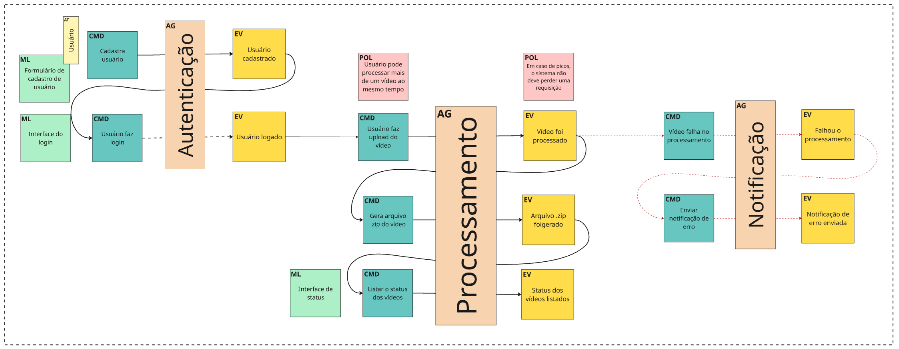

# FIAP X - Sistema de Processamento de Vídeos

## 📝 Sobre o Projeto
O **FIAP X** é uma solução de alta performance desenvolvida para o processamento de vídeos. O sistema recebe arquivos de vídeo, extrai frames (imagens) e consolida essas imagens em um arquivo `.zip`, que é enviado automaticamente para um bucket seguro no **Amazon S3**.
O projeto foi construído seguindo as melhores práticas de arquitetura de software, focando em **escalabilidade**, **desacoplamento** e **qualidade de código**.

---

## 🏗️ Arquitetura do Sistema
A aplicação utiliza uma arquitetura baseada em microsserviços e eventos (EDA - Event Driven Architecture).

* **API Gateway/Controller:** Recebe o upload do vídeo e despacha para processamento.
* **Mensageria (RabbitMQ):** Garante que o sistema não perca requisições em momentos de pico, permitindo o processamento assíncrono.
* **Worker de Processamento:** Utiliza a biblioteca **JavaCV (FFmpeg)** para manipulação de vídeo em nível de sistema.
* **Storage (Amazon S3):** Armazenamento persistente e escalável para os arquivos processados.
* **Notificação (AWS SES / SMTP):** Sistema de alerta proativo para o usuário.

---

## 🧩 Design Orientado a Domínio (DDD) e Fluxo de Eventos

Para a concepção do sistema, aplicamos conceitos de **DDD** e **Event Storming** para mapear o comportamento da aplicação e garantir que os requisitos de negócio fossem atendidos de forma desacoplada.



### **Explicação do Fluxo de Domínio:**

1. **Agregado de Autenticação:**
    * O fluxo inicia com o cadastro e login do usuário, garantindo o requisito de proteção por senha.
    * **Eventos-Chave:** `Usuário cadastrado` e `Usuário logado`.

2. **Agregado de Processamento:**
    * É o coração do domínio. O comando `Usuário faz upload do vídeo` dispara o processamento assíncrono.
    * **Políticas (POL):** Implementamos a política de que o sistema não deve perder requisições em picos e deve permitir múltiplos processamentos simultâneos.
    * **Eventos-Chave:** `Vídeo foi processado`, `Arquivo .zip foi gerado` e `Status dos vídeos listados`.

3. **Agregado de Notificação:**
    * Atuando como um *Side Effect* do processamento, este domínio entra em ação caso o evento `Falhou no processamento` seja disparado.
    * **Comando:** `Enviar notificação de erro`, que resulta no evento final `Notificação de erro enviada`.

---

## 📧 Sistema de Notificações de Erro
Para cumprir o requisito de notificação em caso de erro, implementamos um serviço de e-mail resiliente:

* **Resiliência:** O envio é feito de forma **Assíncrona (`@Async`)**, garantindo que uma falha no servidor de e-mail não interrompa o fluxo principal.
* **Ambiente de Desenvolvimento (Local):** Configurado para utilizar o protocolo **SMTP** integrado ao **Mailhog**. Isso permite que os desenvolvedores validem o disparo e o conteúdo dos e-mails em tempo real através de uma interface web local (`http://localhost:8025`), sem a necessidade de uma conta de e-mail real ou conexão externa.
* **Ambiente de Produção (Cloud):** A arquitetura foi projetada para integração nativa com o **Amazon SES (Simple Email Service)** via SDK da AWS, garantindo alta escalabilidade e segurança.
  > **Nota Técnica:** A implementação completa do SES não foi habilitada neste momento devido às restrições do **AWS Academy**, que limita o acesso a este serviço específico. Portanto, o projeto utiliza o provedor SMTP como uma abstração perfeitamente substituível para o ambiente produtivo.
* **UX (User Experience):** O sistema captura erros técnicos (ex: arquivo corrompido ou codec inválido) e os traduz em mensagens amigáveis para o usuário final, ocultando caminhos de diretórios e logs internos.

---

## 🛠️ Stack Tecnológica
* **Linguagem:** Java 21
* **Framework:** Spring Boot 3.x
* **Processamento de Imagem:** JavaCV (FFmpeg)
* **Mensageria:** RabbitMQ (CloudAMQP)
* **Banco de Dados:** PostgreSQL
* **Cloud:** AWS (S3 e SES)
* **Testes:** JUnit 5 e Mockito

---

## 🚀 Como Rodar Localmente

### 1. Pré-requisitos
* Docker e Docker Compose
* JDK 21

### 2. Infraestrutura
Suba os containers necessários (Postgres, RabbitMQ, Mailhog):
```bash
docker-compose up -d
```

### 3. Execução
Para rodar a aplicação localmente utilizando o servidor de e-mail de teste (Mailhog), utilize o profile `dev`:

```bash
./gradlew bootRun --args='--spring.profiles.active=dev'
```

---

## 🔐 Autenticação

A API utiliza **JWT (JSON Web Tokens)** para garantir a segurança dos dados e o acesso restrito aos vídeos de cada usuário.

### **Endpoints de Autenticação**

#### **1. Registrar Novo Usuário**
* **Método:** `POST`
* **URL:** `/auth/register`
* **Corpo da Requisição:**
```json
{
  "email": "usuario@exemplo.com",
  "password": "senha123"
}
```
##### **Resposta**
* **200 OK:** `Usuário criado com sucesso.`
* **400 Bad Request:** `Email já existe ou dados inválidos`

#### **2. Login**
* **Método:** `POST`
* **URL:** `/auth/login`
* **Corpo da Requisição:**
```json
{
  "email": "usuario@exemplo.com",
  "password": "senha123"
}
```

##### **Resposta**
```json
{
  "token": "eyJhbGciOiJIUzI1NiIsInR5cCI6IkpXVCJ9..."
}
```

### **Usando o Token JWT**
Para acessar os endpoints protegidos, inclua o token no header Authorization:

`Authorization: Bearer SEU_TOKEN_AQUI`

### 🚨 **Importante**
* **Expiração:** O token JWT possui expiração padrão de **1 hora**.
* **Renovação:** Após a expiração, é necessário realizar um novo login.
* **Integridade:** E-mails devem ser únicos no sistema.
* **Segurança:** As senhas são criptografadas antes do armazenamento no banco de dados.

---

## 🔌 Testando a API (Postman/Insomnia)

Para validar o funcionamento, utilize o endpoint abaixo para simular o envio de um vídeo:

### **Upload de Vídeo**
* **Método:** `POST`
* **URL:** `http://localhost:8080/videos/upload`
* **Tipo de Body:** `form-data`

| Chave | Tipo | Valor / Exemplo |
| :--- | :--- | :--- |
| `video` | File | [Seu Arquivo .mp4] |
| `email` | Text | `usuario@teste.com` |
| `videoId` | Text | `video-123` |

> 💡 **Dica para Teste de Erro:** Para validar a resiliência do sistema, tente enviar um arquivo de texto comum (ex: `.txt`) renomeado para `.mp4`. O sistema detectará a falha através do FFmpeg, executará a limpeza automática do disco e enviará um e-mail de notificação de erro automaticamente para o **Mailhog**.

---

## ✅ Boas Práticas e Qualidade

O projeto foi desenvolvido focando em padrões de mercado e robustez:

* **Limpeza de Disco:** Implementada limpeza rigorosa em blocos `finally` para deletar arquivos temporários e diretórios de frames logo após o processamento, evitando o esgotamento do storage do servidor.
* **Segurança de Credenciais:** As chaves sensíveis e senhas não estão "hardcoded"; o projeto está preparado para o uso de variáveis de ambiente.
* **Sanitização de Dados:** Implementado tratamento de caracteres especiais nos e-mails para garantir a criação correta de chaves e pastas no Amazon S3.
* **Testes Unitários:** Cobertura de testes utilizando **Mockito** para garantir que o fluxo de erro dispare as notificações corretamente sem depender de serviços externos.

---

## 🧪 Executando Testes

Para rodar os testes unitários e garantir a integridade do código:

```bash
./gradlew test
```
